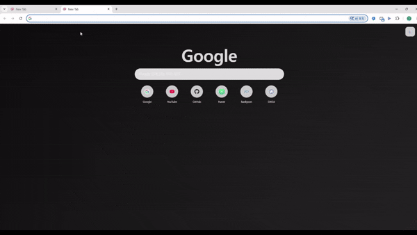

# 🧩 Fancy Shortcuts New Tab (Chrome Start Page)

크롬 새 탭(시작페이지)을 **기본 크롬 느낌(검색창 + 아이콘 숏컷)** 으로 만들면서,  
기본 크롬보다 더 많은 기능(10개 이상 숏컷 / 드래그&드롭 / 배경 업로드 / 톤 설정 / 한 줄 개수 설정)을 지원하는 확장프로그램입니다.

- Google 검색창 + 숏컷 그리드
- 숏컷 **10개 이상** 추가/수정/삭제
- **드래그&드롭**으로 숏컷 순서 변경
- 사이트 **파비콘 자동 표시** (실패 시 이니셜 fallback)
- 배경 이미지 업로드 + 배경 톤(어둡게 / 원본 / 밝게)
- UI 톤(라이트 / 다크), 아이콘 톤(auto / 어둡게 / 밝게)
- 한 줄에 몇 개(columns) 표시할지 설정 + 화면 좁으면 자동 감소
- 스크롤 허용

---

## 📸 Preview

```md

```

---

## 🎯 How to install (GitHub version)

### 1. GitHub에서 다운로드

1. 이 저장소 상단의 **Code** 버튼 클릭
2. **Download ZIP** 선택
3. ZIP 파일 압축 해제

---

### 2. Chrome에서 확장 프로그램 로드

1. Chrome 주소창에 아래 입력 후 Enter

2. 우측 상단 **개발자 모드 (Developer mode)** 활성화

3. **압축해제된 확장프로그램 로드 (Load unpacked)** 클릭

4. 압축 해제한 폴더 선택  
   (`manifest.json` 파일이 있는 폴더)

5. 새 탭을 열어 정상 동작 확인

---

## 🎮 Controls

### 검색창

- URL 입력 → 해당 사이트로 이동
- 일반 텍스트 입력 → Google 검색

---

### 설정 버튼 (⚙️)

설정 패널에서 다음 항목을 변경할 수 있습니다:

- 배경 이미지 업로드
- 배경 톤 선택 (dark, normal, light)
- UI 톤 선택 (dark, light)
- 아이콘 톤 선택 (auto, dark, light)
- 한 줄에 표시할 숏컷 개수(columns) 설정
- 숏컷 추가

---

### 숏컷 타일

각 숏컷 타일에서:

- 클릭 → 해당 사이트로 이동
- 수정 버튼 → 이름 / URL 수정
- 삭제 버튼 → 숏컷 제거
- 드래그 → 순서 변경

---

## ✨ Features

### 1) Chrome-like Layout

- Google 검색창 + 숏컷 그리드 구조
- 기본 Chrome 새 탭과 유사한 UX

---

### 2) Unlimited Shortcuts

- 숏컷 개수 제한 없음
- 추가 / 수정 / 삭제 가능

---

### 3) Drag & Drop Reordering

- 드래그로 숏컷 순서 변경
- 변경 즉시 저장

---

### 4) Automatic Favicon Loading

다음 순서로 favicon 로드:

1. 사이트 favicon

2. Google favicon service

3. 실패 시 이름 첫 글자 fallback 표시

---

### 5) Responsive Grid Layout

- 한 줄에 표시할 숏컷 개수 설정 가능
- 화면 크기에 따라 자동으로 조정
- 스크롤 지원

---

## 🧩 How it works (구현 아이디어)

이 확장은 Chrome의 `chrome_url_overrides` 기능을 사용하여 기본 새 탭 페이지를 `newtab.html`로 대체하고, JavaScript(`newtab.js`)에서 상태(state)를 기반으로 UI를 렌더링하는 방식으로 동작합니다.

### State 기반 UI 구조

확장의 모든 데이터는 하나의 state 객체로 관리됩니다.

- shortcuts: 숏컷 목록
- columns: 한 줄에 표시할 숏컷 개수
- tone / uiTone / iconTone: UI 및 배경 톤 설정
- bgDataUrl: 배경 이미지

UI는 항상 state를 기준으로 생성됩니다.

---

### Chrome Storage를 이용한 데이터 저장

Chrome Storage API를 사용하여 데이터를 저장하고 복원합니다.

- `chrome.storage.sync`  
  → 숏컷 목록 저장 (동기화 가능)

- `chrome.storage.local`  
  → 배경 이미지 및 UI 설정 저장

초기화 시 storage에서 데이터를 불러와 state를 복원합니다.

---

### Grid Layout (CSS Grid)

숏컷 레이아웃은 CSS Grid로 구성됩니다.

```css
grid-template-columns: repeat(var(--cols), 1fr);
```

columns 값이 변경되면 Grid 레이아웃이 즉시 업데이트됩니다.

---

### Dynamic Rendering

숏컷 목록은 JavaScript에서 state.shortcuts를 기반으로 DOM을 동적으로 생성하여 렌더링합니다.

- 각 숏컷은 tile 요소로 생성됩니다.
- favicon, 이름, 수정/삭제 버튼이 함께 렌더링됩니다.
- state가 변경되면 render()를 다시 호출하여 UI를 업데이트합니다.

전체 흐름:

User action → state 변경 → storage 저장 → render() 호출 → UI 업데이트

---

### Favicon loading with fallback

각 숏컷의 favicon은 다음 순서로 로드됩니다:

1. 사이트 기본 favicon (/favicon.ico)
2. Google favicon service
3. 실패 시 이름 첫 글자 fallback 표시

이를 통해 대부분의 사이트에서 favicon을 안정적으로 표시할 수 있습니다.

---

### Background image handling

사용자가 업로드한 이미지는 Base64 Data URL 형식으로 변환하여 저장됩니다.

- chrome.storage.local에 저장
- CSS background-image로 적용

페이지 로드 시 저장된 이미지를 불러와 자동으로 적용됩니다.

---

## ⚠️ Notes

- GitHub에서 압축해제된 확장프로그램 로드 방식으로 설치할 경우  
  기기 간 완전한 동기화는 환경에 따라 제한될 수 있습니다.

- 배경 이미지는 local storage에 저장됩니다.

---
